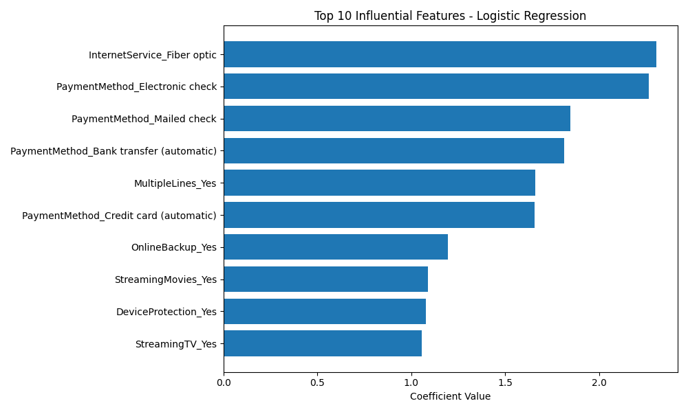
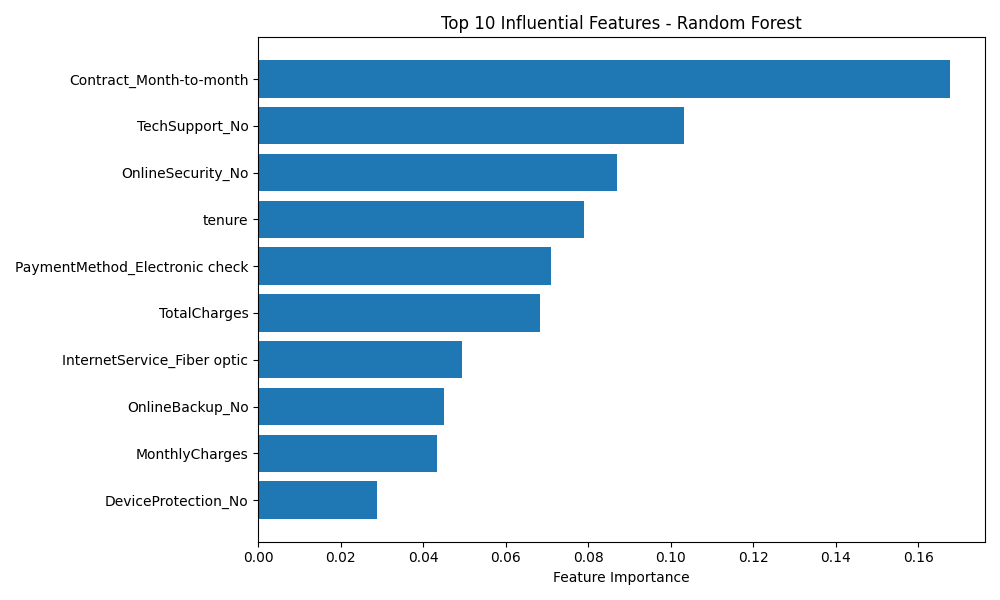

r# 📊 Customer Churn Prediction

This project predicts customer churn using a supervised machine learning approach for a telecom company. While this dataset comes from the telecom industry, the methodology and techniques demonstrated here are **scalable and adaptable to any industry** where customer retention is vital—such as finance, insurance, SaaS, e-commerce, and beyond. 

This project serves as a **showcase of my data science skillset**, including data preprocessing, class imbalance handling, algorithm comparison, hyperparameter tuning, and model interpretation.

---

## 🔍 Problem Statement

Customer churn—when a customer discontinues service—is a key metric for subscription-based companies. For this project, we analyze customer behavior to predict churn using various customer and service attributes. Our goal is to **identify customers at risk of churning**, allowing businesses to take proactive retention actions.

---

## 🧠 Algorithms Used

- **Logistic Regression** (best performing model after SMOTE + tuning)
- **Random Forest** (tuned using GridSearchCV, competitive performance)

We experimented with **K-Nearest Neighbors (KNN)** and **XGBoost**, but deprioritized them based on evaluation results.

---

## 🧪 Data Preprocessing

- Removed irrelevant columns (`customerID`)
- Encoded categorical variables with `LabelEncoder`/`get_dummies`
- Addressed class imbalance using **SMOTE** (on training set only)
- Train/test split: 80% train / 20% test

---

## 📈 Model Evaluation

Metrics used to evaluate models:
- Accuracy
- Precision, Recall, F1-Score (especially for minority class)
- Confusion Matrix
- Feature Importance (visualized)

---

## 🔧 Best Model & Performance

**Best Model**: Logistic Regression  
**Tuned Hyperparameters**:  
```python
{ 'C': 0.1, 'penalty': 'l1', 'solver': 'liblinear' }

| Metric       | Score |
|--------------|-------|
| Accuracy     | 0.779 |
| Precision    | 0.58 (for churned class) |
| Recall       | 0.63 (for churned class) |
| F1-Score     | 0.60 (for churned class) |

---

## 🔍 Feature Importance

Below are the top 10 most influential features based on the two best models:

### Logistic Regression


### Random Forest



---

## 🧰 Tech Stack

- **Languages**: Python 3.12  
- **Libraries/Tools**:
  - `pandas`, `numpy`, `matplotlib`, `seaborn` for data manipulation and visualization  
  - `scikit-learn` for model training, evaluation, and hyperparameter tuning  
  - `imblearn` for SMOTE-based class balancing  
  - `joblib` for model saving  
  - `Jupyter Notebook` + `VS Code` for development  

---

## 👨🏽‍💻 Author

**Patrick Onuoha Jr.**  
Data Science Student @ University of North Texas  
🔗 [GitHub](https://github.com/TheDataTenno) | 📧 [Email](mailto:ponuoha2017@gmail.com) | 🧠 Passionate about building data-driven solutions that scale across industries.
